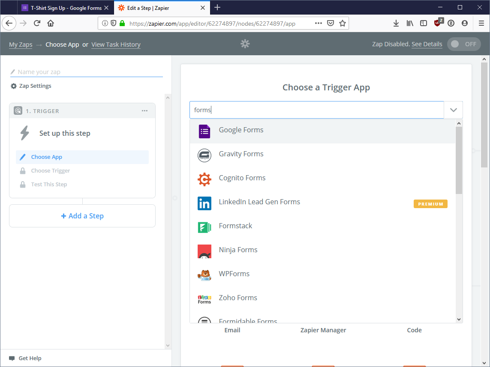
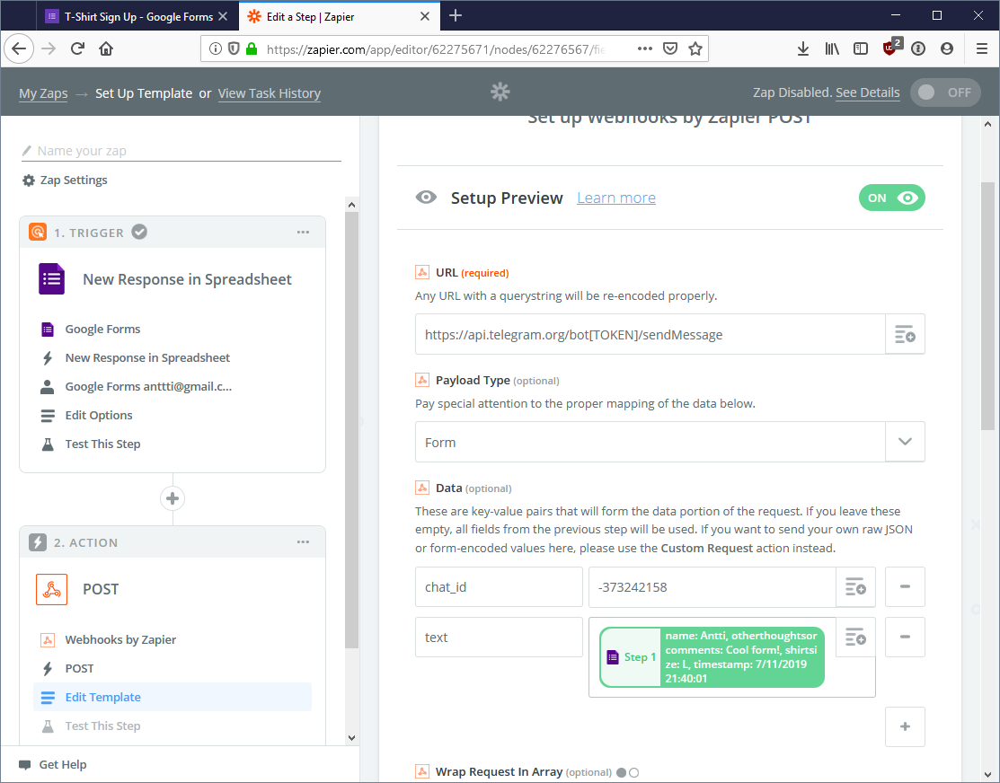

# How to get a notification on your phone on new Google Form entries

[Google Forms](https://www.google.com/forms/about/) is a great, free multipurpose tool for all kinds of information gathering. Wouldn't it be cool to get a push notification on your phone when someone answers to your form? Turns out with a little help from Zapier and Telegram, we can do just that - all without a single line of code!

We'll be tacking the task with:

- Making Google Forms write it's responses to Google Sheets
- Having Zapier react every time a new line is added to the sheet
- Using a Telegram bot to send us a message whenever Zapier tells it to (which is whenever there is new data on the sheet).

## Creating a Google Form

First of all we need a Google Form to draw the data from. For this article I created a form based on Google's examples; I used the "T-Shirt Sign Up" template.

You can test your form by clicking on the Send button in the top right corner of the page. Then select the link symbol from the "Send via" -selection and copy the public link of your form.

Paste this in your browser of choice and presto, there's your brand-spanking new form! Now if you fill it, you'll be able to see the response back in Google Forms' Responses view:

## Setting up Google Sheets

Google Forms collects responses in it's own nifty UI, but unfortunately that does not allow us to automatically process the data forwards. What we _can_ process however are Google Sheets. Luckily it's simple to have Google Forms to write it's responses to a sheet. While on the Responses view, click on the little green Sheets icon to bring up the destination dialog.

Hit Create to create a new sheet for the responses. Google Sheets should pop open with your responses already populated in.

## Setting up Telegram

That's it for the Forms & Sheets side. Let's now take a brief detour to Telegram for the push notifications, and then round back with Zapier to connect everything.

If you're unfamiliar with [Telegram](https://telegram.org/), it's a messaging application not quite unlike WhatsApp - but way more hacker friendly :-) The feature we're especially interested in now are what are called "bots" in Telegram. Bots are pretty much what you'd imagine, small apps running somewhere providing mostly textual information to whoever wants to converse with them. In our case however they are used in a super simplified way:

- A bot can be easily created
- Telegram chat group can be established with a bot
- Zapier can make the bot send a message to the chat
- Telegram can send push notifications on new messages on chats

See how this all is coming together? Let's do this!

First of all, unless you already have a Telegram account you need to install Telegram on your phone and register your phone number to it. Nothing scary, and you'd be probably better off using Telegram instead of WhatsApp anyway :-)

### Creating the bot

Once you have the app running, start a chat with a user called BotFather. You can initiate the chat by searching for the user "BotFather":

Make sure you pick the father that has the checkmark after it's name. There are many BotFathers, but only the checkmarked one is the real deal.

Next, in order to make ourselves a new bot, type `/newbot`. BotFather is going to ask you to name your bot. This is the "full name" of your bot, feel free to add whatever you want. I went with "Form Zap Bot". Next, the BotFather will ask you for the bot's username. There are some rules, as the BotFather will tell you: the bot's name needs to end with `_bot` (it also needs to be globally unique). I went with `form_zap_bot`.

The BotFather will respond with useful information about the bot. The most important piece of information is the **token**. _We'll need it later, so save it somewhere._

Now the bot is ready to serve us! It's quite useless as-is, as there are literally no brains on our bot, but luckily it needs none.

### Setting up a chat with the bot

You can have a word with the bot in multiple ways in Telegram: you can talk 1-to-1 or you can have a group chat, where the only participants are you and the bot. In order for our Zapier integration to work, we need to go the group route. Create a new group in Telegram, naming it whatever you please:

Then invite your friendly bot:

Hang on there, we're almost there. We need just one more piece of information from Telegram, and this one is a bit of a curveball; we need the ID of the group chat you're on with your bot. Now unfortunately there's no super easy way to get the chat ID, you're going to have to log in to the [web version of Telegram](https://web.telegram.org/) (you can log in with just your phone number and then allow the login via your phone). Open the group chat you just created:

Now check the address bar of your browser. You should see something along the lines of `g7384657863` at the end of the address. This is the chat ID and we'll need it later on, so save it along the bot token somewhere safe.

## Connecting it all with Zapier

OK, that was maybe a bit convoluted. But it's the final stretch! Let's bring it all together with [Zapier](https://zapier.com/), a web app that can connect all sorts of pipes on the internet.

### Connecting Zapier to Google Sheets

Log in to Zapier and create a new zap. For the trigger, choose Google Forms:

Now the reason we needed to connect our Google Form to Sheets is clear: Zapier's Google Forms integration is actually behind the scenes a Google Sheets integration! Select New Response in Spreadsheet.

At this point Zapier will ask you to connect your Google account to Zapier if you haven't done so already. After that's in order, select the spreadsheet you created for the form responses:

Zapier then tests the connection. Now the final step in our process: having Zapier make our bot post a message to us!

### Connecting Zapier to Telegram

Now while Zapier has a million billion integrations to all kinds of apps, alas, Telegram is not one of them. But fear not, this is exactly why we had to create the two-person group (well ok, one person, one dimwitted bot) chat earlier. Even though Zapier cannot talk directly to Telegram via it's in-built integrations, we can utilize something called _webhooks_ to make Zapier integrate with Telegram.

Telegram bots can be commanded by making what are called _HTTP requests_ to their _endpoints_. There's some fancy words! This basically just means that Zapier can talk the web's lingua franca with any service, as long as the receiving service can receive our messages. Let's see how this is done.

First, add a new action to the zap and choose the "Webhooks by Zapier" app. From the Webhook setup, choose the POST request:

Now onto configuring the POST request itself. I'll spare you the technical details, let's just get this thing set up and then wonder what we've actually done:

- Set the **URL** to be `https://api.telegram.org/bot[TOKEN]/sendMessage`, replacing the `[TOKEN]` with your Telegram bot token you saved earlier (you _did_ save it , didn't you?)
- **Payload Type** can be set to **Form**
- **Data** is the actual data we want to send to the bot. Data is defined in key-value pairs, of which we have two:
  - `chat_id`: The chat ID we picked up earlier. **Note**: Change the leading `g` from the chat ID to a `-` (a minus sign). Yes, it's a bit weird. No, it won't work unless you do this.
  - `text`: The actual text the bot will say. By hitting the plus button in the right edge of the input box, you can choose values from the just entered Google Form response. For instance, the `Content` field will include the answers to all of your questions the just created response contains. If you're only interested in a single question's answer, you can just pick that from the list.

And that's it! Hit Continue and on the following page you can test the notification by clicking "Send Test To Webhooks by Zapier". The second you click the test button, your bot should send you a message in your Telegram chat!

If you get an error mentioning "Not found", please doublecheck the URL and Data parameters to match how I've described them above. Pay especially attention that in the URL there is the word `bot` before your token, and that there are no spaces or braces or the word TOKEN there anymore. Also make sure the `chat_id` data field does not have the letter `g` as its prefix, instead there should be a `-` followed by a series of numbers.

## All done!

Now all that's left to do is to name your zap and enable it. If you're running the free plan of Zapier, it will check for new form responses once every 15 minutes and then your bot will ping you on Telegram. Congratulations, this was perhaps in the more complicated end of workflows, but armed with this information you can harness the power of Telegram notifications for so much more!
